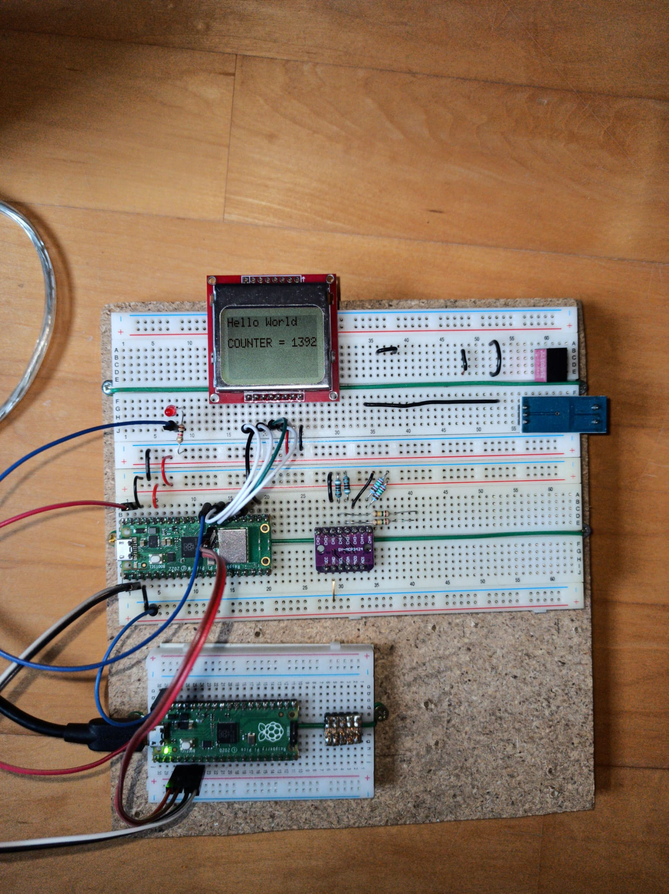

This is a driver for Pcd8544 driven displays, for the embedded graphics library (https://docs.rs/embedded-graphics/latest/embedded_graphics/)

These are LCD displays with low power consumption, no active lighting
needed in daylight. They where initially used in Nokia phones like Nokia 5110. Google for "Pcd8544" and "Nokia 5110 lcd" for more information.

The driver is very simple, basically copy&paste from these sources:

- the documentation in https://github.com/embedded-graphics/embedded-graphics/blob/master/core/src/draw_target/mod.rs
- the initialization code is adapted from here: https://github.com/n-eq/pcd8544-rs/blob/master/src/lib.rs
- bits and pieces from https://github.com/cschuhen/oled_drivers

There is example code for raspberry pi pico, using the embassy library under /examples/rp/rp_simple.

Here a picture of the display in action on a breadboard setup.

